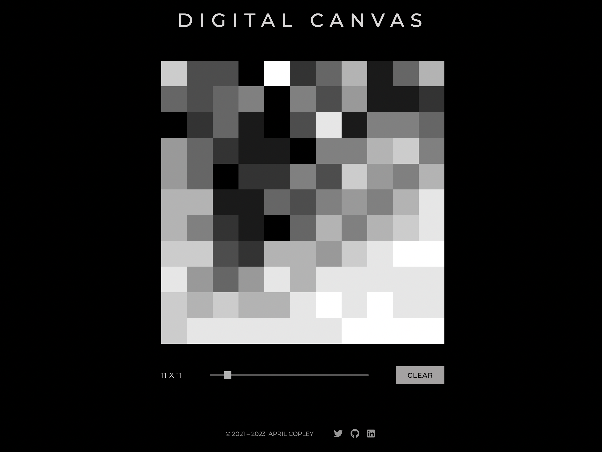

# Digital Canvas
Modeled after a beloved childhood toy, enjoy this interactive art experience created without any fancy libraries or frameworks.

**[Visit live site](https://acopperlily.github.io/digital-canvas)**

## How It's Made

**Tech used:** 
-  HTML
-  CSS
-  JavaScript

With either the tap of a finger or the movement of the cursor, the cells turn darker and darker until completely black. Then the cells reset to white, and the process begins all over again. The size of the cells is adjustable via the slider, and you can reset the canvas by clicking the "CLEAR" button. There is an option to view grid lines, allowing you to target cells with precision.

## Optimizations

Advanced features would include a color selection, drawing mode (click or drag), and applying an optional blur effect.

## Lessons Learned

I learned how to use simple math to both build the grid and implement the shading increments.

## Other Projects

**[Happy Hour Cocktails](https://acopperlily.github.io/happy-hour-cocktails)**

**[Catalyzer](https://catalyzer.netlify.app)**

**[Cats On Demand](https://acopperlily.github.io/cats-on-demand)**

